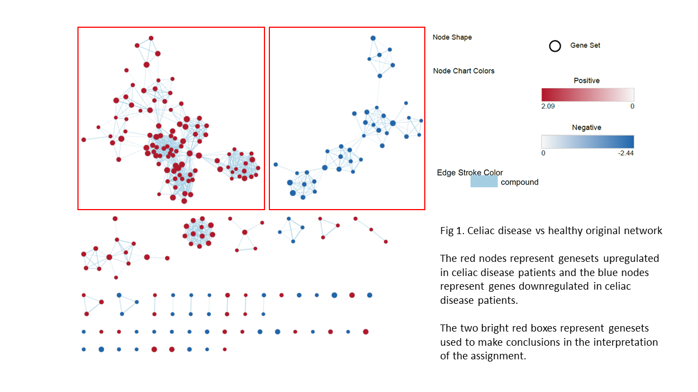
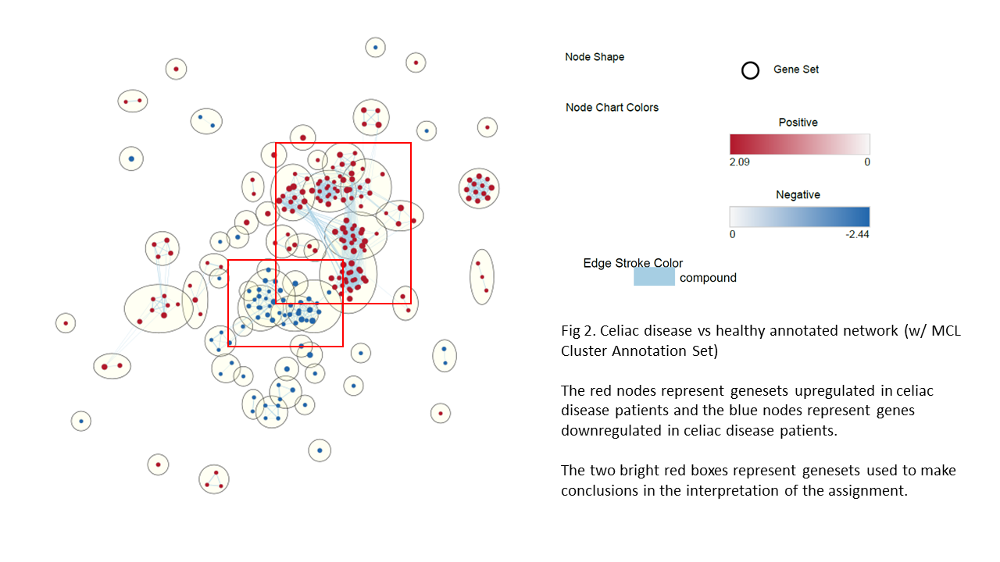
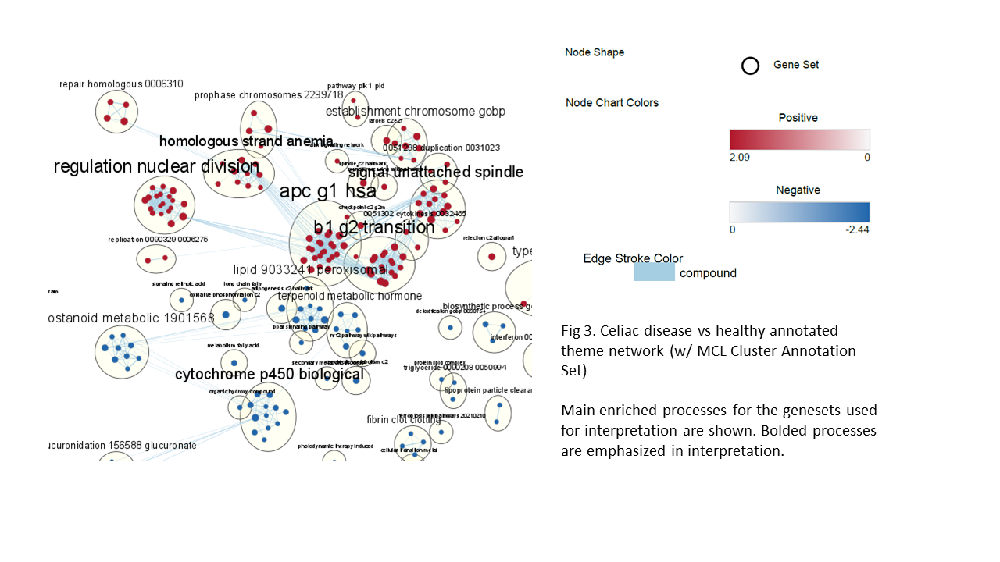
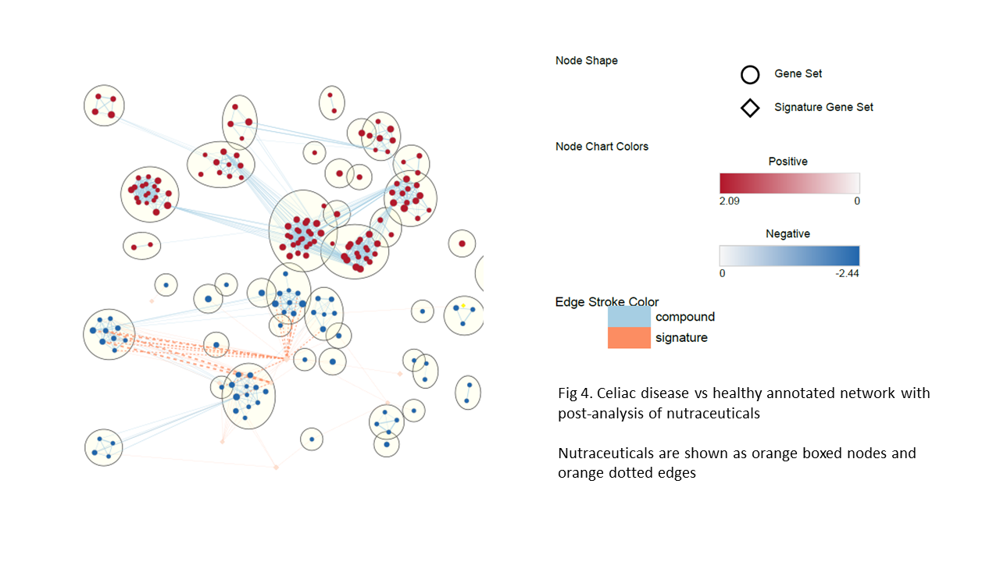

# Introduction to Data

## Overview

**This is an RNA sequencing dataset comparing celiac disease patients to healthy controls.**

**Link & GSE Accession :** [GSE146190](https://www.ncbi.nlm.nih.gov/geo/query/acc.cgi?acc=GSE146190)

**Submission date:** Mar 02 2020

**Last update date:** Feb 16 2021

**Samples and Overall design (from GEO):** Upper colonoscopy (duodenal) biopsies from 5 control(CTR) and 11 celiac disease patients (PED) were taken, total RNA was extracted and RNA-sequencing was performed

**Note:** As shown in the workflow, the samples only included 5 healthy controls and **6 CeD patients**.  This was confirmed by the paper which cites the dataset.

**Paper associated with dataset:**
[Systematic Prioritization of Candidate Genes in Disease Loci Identifies TRAFD1 as a Master Regulator of IFNγ Signaling in Celiac Disease](https://pubmed.ncbi.nlm.nih.gov/33569077/)

## Platform Info

**Platform title :** Illumina HiSeq 2500 (Homo sapiens)

**Submission data :** Mar 14 2013

**Last update data :** Mar 27 2019

**Organims :** Homo sapiens (taxid: 9606)

## Data Cleaning & Normalization Info

**Gene count of initial dataset:** 45728

**Gene count after cleaning, normalization, and identifier mapping:** 15781

## Differential Gene Expression and Thresholded ORA Info

Using the Exact Test in EdgeR, upregulated and downregulated genes within a certain threshold were analyzed using ORA in g:Profiler.

**FDR Threshold used:** < 0.01

**Number of Upregulated Genes:** 1252

**Number of Downregulated Genes:** 527

**Summary of Results from g:Prolifer ORA**
```{r}
ORA_Results <- data.frame(Geneset = c("Upregulated", "Downregulated", "All Differentially Expressed"), Number = c(1252, 527, 1779), Process = c("Mitotic sister chromatid separation", "Fatty acid catabolism", "Mitotic sister chromatid separation"), FDR = c("<0.01", "<0.01", "<0.01"), P.adj = c(10e-32, 10e-15, 10e-24))
colnames(ORA_Results) <- c("Geneset", "Number of Genes", "Main Enriched Process", "FDR Threshold (from DE analysis)", "Approximate Adjusted P-val (from G:profiler)")

library(knitr)
kable(ORA_Results, "html", align = "llll")
```

**Interpretation of ORA**

Based on other sources, the upregulated ORA is supported because celiac disease is associated with an "increased mitotic index".  Sister chromatid separation is a part of mitosis, so this explains that enriched process.

For the downregulated ORA being enriched for fatty acid catabolism, it is worth noting that another enriched process associated with this is carboxylic acid catabolism and gluten has carboxylic acid groups on it.  From this we can infer a potential downregulation of gluten catabolism, which makes sense because celiac disease is a gluten allergy that does not allow it to be digested and provokes an immune response.

Lastly, the ORA for all differentially expressed genes is weighted towards enriched processes for the upregulated genes, and this can be attributed to the fact that approximately 2/3 of the differentially expressed genes are upregulated.

## Summary and Introduction to A3

As seen in the introduction, there are clear differences in gene expression between the celiac disease patients and the healthy controls.  However, it is important not to just look at the differentially expressed genes, but all expression, which is where the Non-Thresholded GSEA comes into play...

Link to A1: [Assignment 1 .html](https://github.com/bcb420-2021/Nasha_Sethna/blob/main/Assigment1/Nasha%20Sethna%20-%20Assignment-1-R-Notebook.html)


Link to A2: [Assignment_2 .html](https://github.com/bcb420-2021/Nasha_Sethna/blob/main/A2_NashaSethna.html)


# Non-thresholded Gene set Enrichment Analysis (GSEA)

**What method did you use? What genesets did you use? Make sure to specify versions and cite your methods.**
* Parameters:
  + Max Geneset Size: 200
  + Max Geneset Size: 15

This minimized computation time and ensured more specific genesets for the results.  Larger genesets would most likely not be very 

* Files used:
  + I used Supplementary_Table3_Human_GOBP_AllPathways_no_GO_iea_March_01_2021_symbol.gmt as my pathways file. Its the most up to date human pathways file on the Bader lab site that doesn't have electronic annotations and this ensured up to date information that is meaningful.
  + I used the .rnk file from A2 


**Summarize your enrichment results.**

I've summarized the most interesting genesets and enriched processes below:

```{r}
Reg <- c("HALLMARK_INTERFERON_ALPHA_RESPONSE", "MITOTIC NUCLEAR DIVISION", "UNSATURATED FATTY ACID METABOLIC PROCESS", "VITAMIN TRANSPORT")
UD <-  c("Up", "Up", "Down", "Down")
FN <-  c("0.00, 2.09", "0.00, 2.00", "0.00, -2.44", "0.00, 2.26")
GSEA_Results <- data.frame(Reg = Reg, UD = UD, FN = FN)
colnames(GSEA_Results) <- c("Main Enriched Process", "Up or Downregulated", "FDR, NES")

kable(GSEA_Results, "html", align = "lll")
```


**How do these results compare to the results from the thresholded analysis in Assignment #2. Compare qualitatively. Is this a straight forward comparison? Why or why not?**

The main negative and positively regulated genesets are almost identical to those of the thresholded analysis in Assignment 1.  Its important to note, though, that there is a wider breadth of processes in the GSEA than the thresholded ORA because there are more genes and expression data we used to do the analysis.  For example, there are many more metabolic processes being downregulated in the GSEA whereas the ORA was mostly enriched for fatty acid catabolism specifically.  For the aforementioned reason of more genes and expression data being used, **no, this is not a straight forward comparison** because we are using 15781 genes and their expression data for the GSEA, whereas in the thresholded ORA, we only used 1779.


# Visualizing the GSEA in Cytoscape

##Enrichment Map Parameters, Results, and Annotations

* Thresholds
  + FDR : 0.01
  + P-Value : 1
  
* Similarity Filtering
  + Jaccard-Overlap (50%)
  + Cutoff: 0.375
  + Combine edges across dataset

* Nodes and Edges
  + Nodes : 306
  + Edges : 1520

* Annotation: MCL Cluster Annotation Set w/ default parameters

## Interpretation of EM

My figures summarizing my EM analysis are here:
```{r}
#Download A3_Figures from my repo: #https://github.com/bcb420-2021/Nasha_Sethna/tree/main/A3_Figures







```

**Collapse your network to a theme network. What are the major themes present in this analysis? Do they fit with the model? Are there any novel pathways or themes?**

The major themes present in this network is a downregulation of process having to do with metabolism and an upregulation of process having to do with mitosis and cell division.  You can see this in Figure 3 specifically in A3_Figures, where the main bolded processes for upregulation are "g2 transition" and "regulated nuclear division" and the like.  The same goes for the downregulated processes such as "cytochrome p450 biological process" which is a digestive enzyme in the intestine (which is the tissue these samples are from).

Yes, these themes do fit with the model of celiac disease vs healthy controls, and this is expanded upon in the interpretation below.

There are novel themes but these are in nodes that do not have much connectivity or are completely separate from the "main" pathways/genesets (highlighted in Fig 1 and Fig 2 in A3_Figures), and therefore they seem to be outliers rather than meaningful themes or pathways.
  

# Interpretation
**Do the enrichment results support conclusions or mechanism discussed in the original paper? How do these results differ from the results you got from Assignment #2 thresholded methods?**

No, there is no mention of these specific enriched processes in the original paper.  This may be because the paper that cites this dataset does not only use this dataset but two more RNA sequencing datasets from intestinal T-cells, which, from the content of the paper, seem to be pervade most of their results.  This rings true for the analyses for both A2 and the GSEA from this assignment because they returned many of the same enriched processes.


**Can you find evidence, i.e. publications, to support some of the results that you see. How does this evidence support your result?**

Yes, as stated in the introduction, the upregulation of mitotic nuclear division is able to be supported because celiac disease is associate with an "increased mitotic index" due to rapid cell division in the duodenum during gluten-sensitivity-based attacks.  There is another aspect to this that was not picked up in the ORA, which was the interferon alpha response.  This is able to be supported quite well because in celiac disease is associated with an immune response to gluten and interferon alpha is a cytokine produced by the immune system in response to infections and the like.

Lastly, for the downregulated processes, I originally though the downregulation of fatty acid metabolism was also associated with downregulation of carboxylic acid groups, particularly those on gluten, but actually digestion as a whole is halted in people with celiac disease when they are exposed to gluten and it has lasting side effects of prolonged digestive issues.  Therefore, this downregulation of fatty acid metabolism is due to those lasting digestive issues.  The same can be said for vitamin transport, as celiac disease patients are often deficient in many vitamins, owing to the halt of vitamin transport during the halt in digestion.


# Post-Analysis

I decided to add a **post-analysis** to my main network using **nutraceutical drugs** from DrugBank.  The reason for this is because celiac disease doesn't actually have any pharmaceuticals to treat it (a lot of drugs were or are currently in a clinical trial phase) and during my research for A2, there were a lot of "over the counter" recommendations like certain vitamins and plant extracts to help ease the symptoms of gluten sensitivity in patients with celiac disease.

Therefore, I wanted to check if any nutraceutical drugs overlapped with the genesets in my enrichment map and if those are actually drugs used in practice.  A visualization of this can be found in Fig 4 in A3_Figures.

## Process of Post-Analysis

**Type of Analysis:** Exploratory - I don't know what drugs potentially target these genesets, so I'm just using the whole nutraceutical signature geneset

Link: [http://download.baderlab.org/EM_Genesets/March_01_2021/Human/symbol/DrugTargets/Human_DrugBank_nutraceutical_symbol.gmt](DrugBank Nutraceuticals)

**Overlap Test:** Mann-Whitney

There were **9 nutraceuticals** that overlapped with the genesets in the EM, most of them actually overlapped with the **downregulated genesets**, particularly the . I've summarized the important ones here:

```{r}
Drug <- c("Tretinoin", "Vitamin A", "Pyridoxal Phosphate", "Ephedra Sinica Root")
Main <-  c("Cytochrome P450 metabolic processes", "Primary alcohol metabolism", "Cellular lipid metabolic processes", "Cytochrome p450 metabolic processes")
Genes <-  c(18, 15, 53, 13)
Mann_Whitney <-  c(0.010, 0.018, 0.021, 0.0253)
Post_Results <- data.frame(Drug = Drug, Main = Main, Genes = Genes, Mann_Whitney = Mann_Whitney)
colnames(Post_Results) <- c("Nutraceutical", "Main Enriched Process", "Genes", "Mann-Whitney Value")

kable(Post_Results, "html", align = "llll")
```

**What does this post analysis show?**
I was able to find evidence that Vitamin A and its derivative, tretinoin, are often prescribed to celiac disease patients because they are often deficient in it.  Furthermore, pyridoxal phosphate is the active form of vitamin B6, which celiac disease patients have also been known to be deficient in.  These overlaps with the downregulated metabolic processes make sense because they are being prescribed to improve those processes in celiac disease patients.  Lastly, ephedra sinica root is an interesting one because its associated with Cytochrome p450 metabolic processes which aid with digestion. It has been known to have adverse effects on digestion, so this one is actually counter-intuitive, but nonetheless, interesting.


# References

**DrugBank Pages for:** Tretinoin, Vitamin A, Pyridoxal Phosphate, Ephedra Sinica Root

**Paper associated with data:** van der Graaf, A., Zorro, M. M., Claringbould, A., Võsa, U., Aguirre-Gamboa, R., Li, C., Mooiweer, J., Ricaño-Ponce, I., Borek, Z., Koning, F., Kooy-Winkelaar, Y., Sollid, L. M., Qiao, S. W., Kumar, V., Li, Y., Franke, L., Withoff, S., Wijmenga, C., Sanna, S., Jonkers, I., … BIOS Consortium (2021). Systematic Prioritization of Candidate Genes in Disease Loci Identifies TRAFD1 as a Master Regulator of IFNγ Signaling in Celiac Disease. Frontiers in genetics, 11, 562434. https://doi.org/10.3389/fgene.2020.562434

**Sources used for interpretation:**

Chibbar, R., & Dieleman, L. A. (2019). The Gut Microbiota in Celiac Disease and probiotics. Nutrients, 11(10), 2375. https://doi.org/10.3390/nu11102375

Ribeiro, M., Lopes, S., Picascia, S., Gianfrani, C., & Nunes, F. M. (2020). Reinventing the nutraceutical value of gluten: The case of l-theanine-gluten as a potential alternative to the gluten exclusion diet in celiac disease. Food chemistry, 324, 126840. https://doi.org/10.1016/j.foodchem.2020.126840

Xie, F., Ding, X., & Zhang, Q. Y. (2016). An update on the role of intestinal cytochrome P450 enzymes in drug disposition. Acta pharmaceutica Sinica. B, 6(5), 374–383. https://doi.org/10.1016/j.apsb.2016.07.012

https://www.sciencedirect.com/topics/immunology-and-microbiology/coeliac-disease

https://www.imaware.health/blog/celiac-disease-vitamin-deficiencies


**R Packages used:** knitr, RCy3, ggplot2, BiocManager, RCurl
